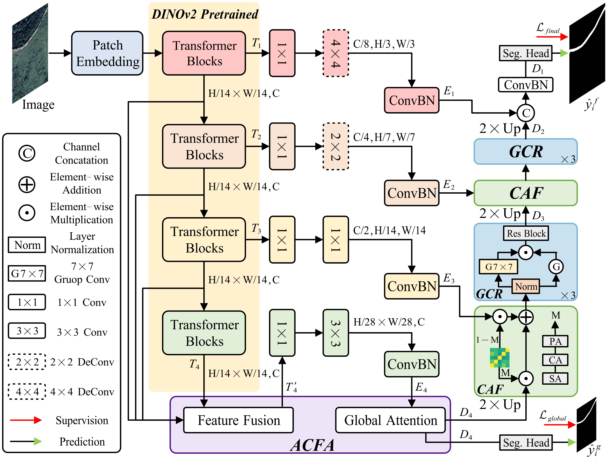
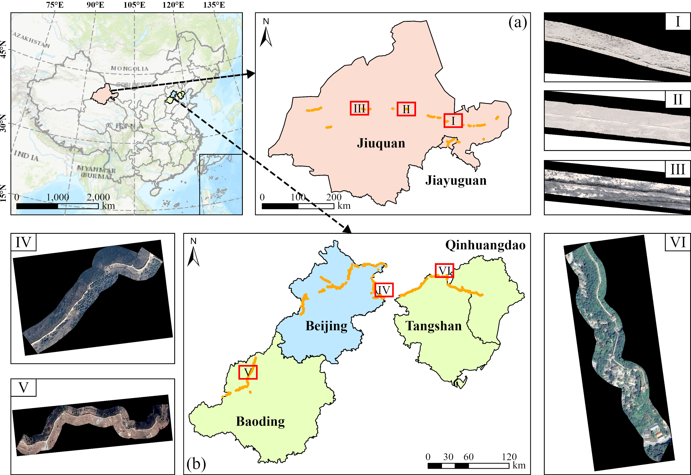

# GWSegNet

This repository contains the official PyTorch implementation of the paper **GWSegNet: A heritage segmentation network for identifying Great Wall traces in high resolution remote sensing imagery**, submitted to the *[Engineering Applications of Artificial Intelligence](https://www.sciencedirect.com/journal/engineering-applications-of-artificial-intelligence) (EAAI)*.

## 📢 News

- **[2026-09-01]** The GWSegNet repository is created.
- **[2026-08-31]** The codes for our recent works, including [SGGWSeg](https://github.com/2022jiangjiazheng/SGGWSeg) and [TFCL-Net](https://github.com/HariwW/TFCL-Net), are also publicly available.
- **[Coming Soon]** The dataset access will be released. 

## 📝 Abstract

Automatic identification of Great Wall archaeological traces from high resolution remote sensing (RS) imagery is important for large-scale heritage monitoring and archaeological survey. However, this task remains challenging because the traces often exhibit weak visual saliency and strong background interference in complex environments.

To address these issues, this study proposes GWSegNet, a heritage segmentation network for Great Wall trace identification with enhanced feature representation and weak trace refinement. Specifically, DINOv2 is adopted as the backbone to provide transferable dense visual representations. To adapt these representations to weak archaeological traces, an adaptive cross-level feature aggregation (ACFA) module is designed to enhance trace representation through adaptive weighting and global attention. A complementary attention fusion (CAF) module is introduced to integrate high-level semantic responses and low-level spatial details in a complementary manner, improving the spatial continuity of Great Wall traces. A gated context refinement (GCR) module is incorporated into the decoding stage to suppress background interference and preserve trace features. Three annotated datasets, namely GS-GW, HB-GW, and BJ-GW, are constructed under different environmental conditions for evaluation.

Experimental results show that the proposed method consistently outperforms representative semantic segmentation and linear object extraction methods across all datasets.

## ✨ Contributions

1. A heritage segmentation framework, GWSegNet, is developed for extracting weak and elongated Great Wall traces from high resolution RS imagery. By adapting DINOv2 representations with ACFA, CAF, and GCR modules, the framework enhances trace representation, the fusion of semantic cues and spatial details, and background suppression in complex archaeological landscapes.
2. Three annotated Great Wall trace datasets are constructed to cover representative eastern and western sections with different preservation conditions and environmental backgrounds. These datasets provide standardized training and evaluation samples for linear heritage extraction from RS imagery.
3. Comprehensive experiments and practical case studies are conducted to evaluate the proposed framework. Quantitative comparisons, route updating, and large-scale trace discovery experiments demonstrate the effectiveness and applicability of GWSegNet for Great Wall heritage mapping.

## 🚀 Framework

<p align="center">
  
</p>
<p align="center">
  <em>Overall framework of the proposed GWSegNet.</em>
</p>

The DINOv2 encoder provides four intermediate feature representations. ACFA aggregates the multi-stage features and applies global attention. The decoder then progressively restores spatial resolution through CAF and GCR blocks, followed by a detail refinement stage and the final segmentation head.

## 📂 Dataset

The study areas cover representative Great Wall relic environments in western and eastern China. The western source region includes the Jiuquan and Jiayuguan sections in Gansu Province, where traces are widely distributed and closely associated with desert landscapes. The eastern source regions include Beijing and Hebei Province, where Great Wall traces are generally characterized by dense  vegetation cover and relatively well-preserved structures .

<p align="center">
  
</p>
<p align="center">
  <em>Study areas and representative Great Wall relic imagery.</em>
</p>

The current loader expects image patches and binary masks organized as:

```text
<DATA_ROOT>/
├── train/
│   ├── images/
│   │   └── <sample>.{png,tif,tiff,jpg,jpeg}
│   └── masks/
│       └── <sample>.{png,tif,tiff,jpg,jpeg}
└── test/
    ├── images/
    │   └── <sample>.{png,tif,tiff,jpg,jpeg}
    └── masks/
        └── <sample>.{png,tif,tiff,jpg,jpeg}
```

The default region is `beijing`, corresponding to `data/greatwall_beijing`. Configure another local dataset without editing the source code:

```bash
export GREAT_WALL_REGION=beijing
export GREAT_WALL_DATA_ROOT=/path/to/greatwall_beijing
```

The regional subsets and download information are summarized below. Baidu Netdisk links and access codes will be added after the archives are uploaded.

| Dataset | Study Area | Download | Access Code |
| :-----: | :--------: | :------: | :---------: |
| **GS-GW** | Gansu | *Coming soon* | — |
| **HB-GW** | Hebei | *Coming soon* | — |
| **BJ-GW** | Beijing | *Coming soon* | — |

## 🛠️ Usage

### 1. Dependencies

Create an environment, install the PyTorch build matching your CUDA version,
and then install the remaining dependencies:

```bash
conda create -n gwsegnet python=3.11 -y
conda activate gwsegnet

pip install torch==2.1.2 torchvision==0.16.2 torchaudio==2.1.2 \
  --index-url https://download.pytorch.org/whl/cu121
pip install -r requirements.txt
```

### 2. Pretrained Weights

GWSegNet uses the official DINOv2 ViT-S/14 backbone. Download the checkpoint and place it at:

```text
model_weights/dinov2_small.pth
```

```bash
mkdir -p model_weights
wget https://dl.fbaipublicfiles.com/dinov2/dinov2_vits14/dinov2_vits14_pretrain.pth \
  -O model_weights/dinov2_small.pth
```

### 3. Training

```bash
python train.py -c config/greatwall/gwsegnet.py
```

### 4. Evaluation

```bash
python test.py \
  -c config/greatwall/gwsegnet.py \
  --checkpoint model_weights/gwsegnet/beijing/gwsegnet/gwsegnet.ckpt \
  -o results/gwsegnet
```

### 5. Inference

Use `infer.py` when ground-truth masks are unavailable:

```bash
python infer.py \
  -c config/greatwall/gwsegnet.py \
  --checkpoint model_weights/gwsegnet/beijing/gwsegnet/gwsegnet.ckpt \
  -o results/gwsegnet_unlabeled
```

## ✒️ Citation

If you find this work useful, please consider citing the GWSegNet paper. The BibTeX entry will be added after publication.

## 🤝 Acknowledgements

This project is developed from the [UrbanSSF](https://github.com/KotlinWang/UrbanSSF) and [GeoSeg](https://github.com/WangLibo1995/GeoSeg) codebases and uses components from [DINOv2](https://github.com/facebookresearch/dinov2). We thank the  authors and the developers  for their open-source contributions.

## 📄 License

This project is distributed under the terms provided in [LICENSE](LICENSE).
